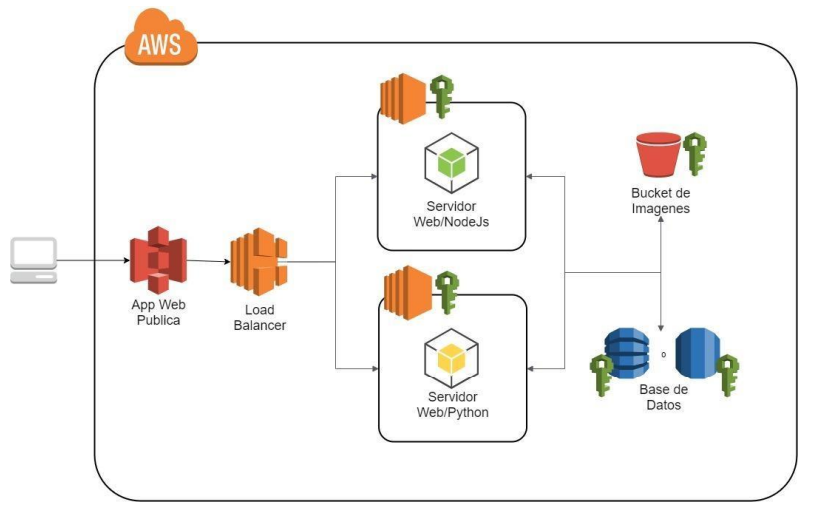
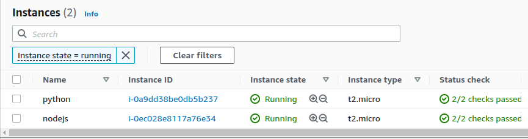
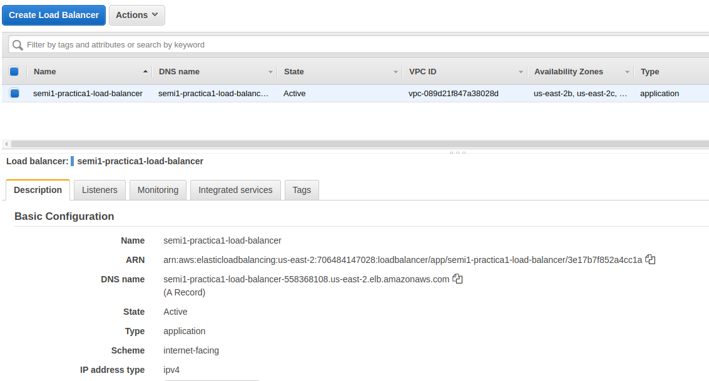
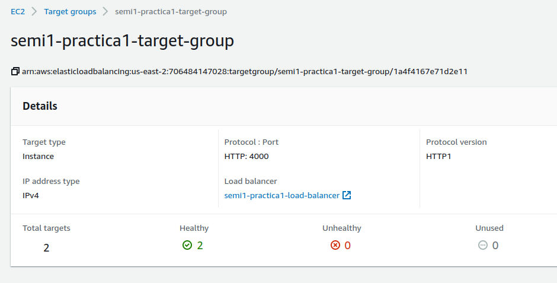
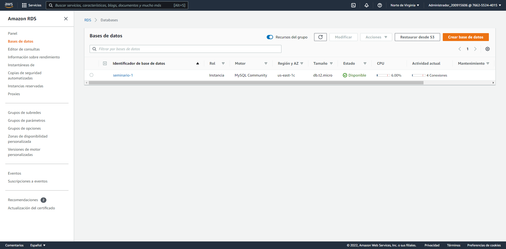
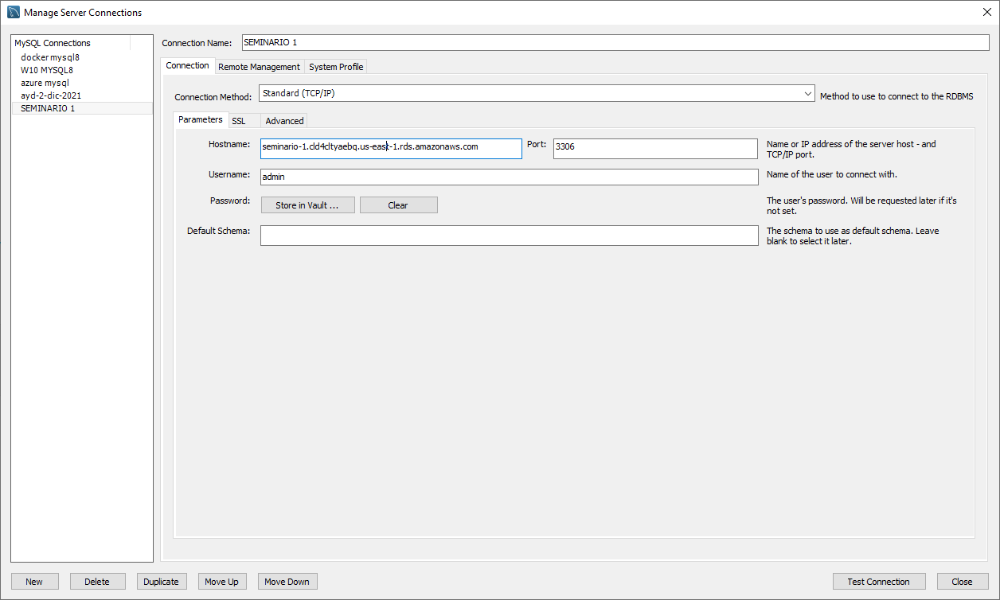
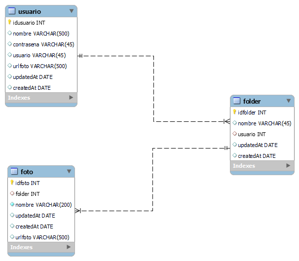
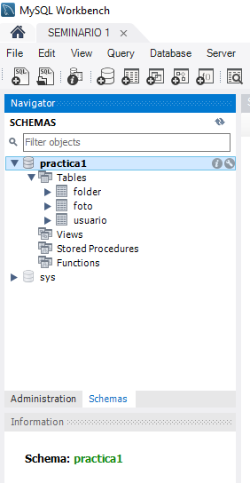

**Universidad de San Carlos de Guatemala**  
**Facultad de Ingeniería**  
**Escuela de Ciencias y Sistemas**  
**Seminario de sistemas 1 - Sección B**  
**Ing. Ludwing Federico Altan Sac**

<p align="center"></p>

<h2> Grupo 5 </h2>

| Carné     | Nombre                          |
| --------- | ------------------------------- |
| 201801480 | Cristian Alexander Gómez Guzmán |
| 201801351 | Elmer Gustavo Sánchez García    |
| 201807265 | Kevin José Sandoval Catalán     |
| 200915606 | Nelson Daniel Cruz              |

<br/>

**<p align="center">Primer semestre 2022</p>**

## Contenido

- [🔸Arquitectura utilizada](#arquitectura-utilizada)
- [🔸Usuarios IAM](#usuarios-iam)
  - [practica1-grupo5-S3](#practica1-grupo5-s3)
- [🔸Capturas de Pantalla](#capturas-de-pantalla)
  - [Buckets de S3](#buckets-de-s3)
    - [Almacenamiento de imágenes](#almacenamiento-de-imágenes)
  - [EC2](#ec2)
  - [Instancia de RDS](#instancia-de-rds)
  - [Aplicación Web](#aplicación-web)

# 🔸Arquitectura utilizada

<p align="center"></p>


### Se creo la aplicación WEB con la biblioteca de ReactJS. Se utilizaron dos intancias EC2 en una esta el servidor hecho con python y el otro con nodejs, se implemento un balanceador de carga, para distribuir las cargas de la aplicación y asi contar con un servicio de alta disponibilida, los datos son almacenados en una base de datos de MYSQL con el servicio RDS, las imagenes subidas a la aplicación son almacendas en un bucket de S3. 

# 🔸Usuarios IAM


## practica1-grupo5-S3

**Políticas de permisos (1 política aplicada)**

- Nombre de la política: AmazonS3FullAccess
- Tipo de política: Política administrada por AWS

## admin-s3

**Políticas de permisos (1 política aplicada)**

- Nombre de la política: AmazonS3FullAccess
- Tipo de política: Política administrada por AWS

## ec2-admin

**Políticas de permisos (1 política aplicada)**

- Nombre de la política: AmazonEC2FullAccess
- Tipo de política: Política administrada por AWS

# 🔸Capturas de Pantalla

## Buckets de S3

### Almacenamiento de imágenes

<p align="center"></p>

**Política S3**

```json
{
  "Version": "2012-10-17",
  "Statement": [
    {
      "Sid": "PublicReadGetObject",
      "Effect": "Allow",
      "Principal": "*",
      "Action": "s3:GetObject",
      "Resource": "arn:aws:s3:::practice1-g5-images/*"
    }
  ]
}
```

## EC2
**Instancias**
<p align="center"></p>

**Aplication load balancer**
<p align="center"></p>

**Target group**
<p align="center"></p>

## Instancia de RDS
<p align="center"></p>

### RDS configuración
<p align="center"></p>

### ER
<p align="center"></p>

### Base de datos
<p align="center"></p>

## Aplicación Web

#### Buckets de S3 de un sitio estático

<p align="center"></p>

**Política S3**

```json
{
  "Version": "2012-10-17",
  "Statement": [
    {
      "Sid": "PublicReadGetObject",
      "Effect": "Allow",
      "Principal": "*",
      "Action": "s3:GetObject",
      "Resource": "arn:aws:s3:::semi1-practica1-g5/*"
    }
  ]
}
```
